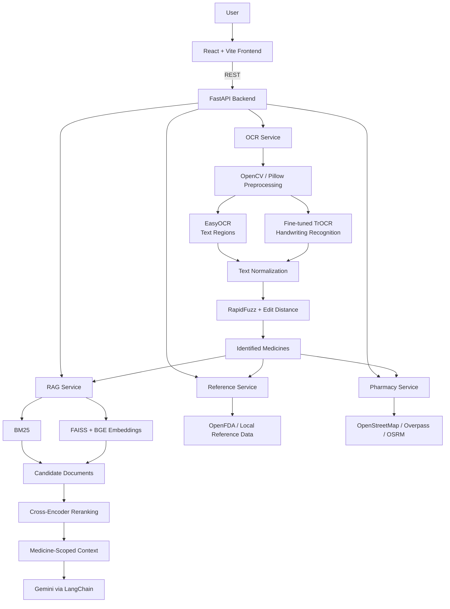

# RxReader

**End-to-end prescription understanding system: handwriting OCR, medicine-name correction, hybrid RAG, and a full-stack web application.**

RxReader converts handwritten or printed prescription images into structured medicine information. It combines classical computer vision, a fine-tuned transformer OCR model, deterministic post-processing, and a medicine-scoped retrieval-augmented generation (RAG) pipeline, served through a FastAPI backend and a React frontend.

[Live Demo](#) | [TrOCR Model](https://huggingface.co/Anji-th/prescription-trocr) | [API Docs](#api)

> **Notice:** RxReader is an AI-assisted information system built for educational and research purposes. It is not a medical device and must not be used to diagnose conditions, determine dosages, or make medication decisions. See the [Disclaimer](#disclaimer).

---

## Table of Contents

1. [Overview](#overview)
2. [Key Features](#key-features)
3. [System Architecture](#system-architecture)
4. [Processing Pipeline](#processing-pipeline)
5. [Core Components](#core-components)
6. [RAG Pipeline](#rag-pipeline)
7. [Technology Stack](#technology-stack)
8. [Project Structure](#project-structure)
9. [Backend Design](#backend-design)
10. [API](#api)
11. [Getting Started](#getting-started)
12. [Docker and Deployment](#docker-and-deployment)
13. [Engineering Decisions](#engineering-decisions)
14. [Evaluation](#evaluation)
15. [Security and Privacy](#security-and-privacy)
16. [Limitations](#limitations)
17. [Roadmap](#roadmap)
18. [Disclaimer](#disclaimer)
19. [License](#license)
20. [Author](#author)

---

## Overview

Prescriptions are difficult to digitize: handwriting is highly variable, medicine names are domain-specific, and small character-level OCR errors can change the identified drug entirely. General-purpose OCR engines handle this poorly.

RxReader addresses the problem as a multi-stage pipeline rather than a single model:

1. **Preprocess** the uploaded image (OpenCV, Pillow).
2. **Detect and recognize** text using EasyOCR for text regions and a **fine-tuned TrOCR** model for handwritten recognition.
3. **Correct** OCR output against a medicine dictionary using RapidFuzz and edit-distance matching.
4. **Resolve** the result into structured medicine records with reference data and images.
5. **Answer** follow-up questions through a **medicine-scoped hybrid RAG** assistant (BM25 + FAISS + cross-encoder reranking + Gemini).
6. **Extend** results with translation, text-to-speech, and nearby pharmacy discovery.

The project focuses on connecting ML inference to a usable, deployed application, including model hosting, index building at image build time, and containerized deployment.

---

## Key Features

**Prescription OCR**

- Handwritten and printed prescription image upload
- Image preprocessing (resizing, normalization, contrast enhancement)
- Text region detection with EasyOCR
- Handwritten text recognition with a domain fine-tuned TrOCR model

**Medicine Identification**

- Text normalization and dictionary-based correction using RapidFuzz and edit distance
- Confidence-thresholded matching (corrected / uncertain / unrecognized)
- Structured medicine cards with reference information and images

**Medicine-Scoped RAG Assistant**

- Hybrid retrieval combining BM25 (lexical) and FAISS with BGE embeddings (semantic)
- Cross-encoder reranking of candidate documents
- Retrieval constrained to the selected medicine to avoid cross-medicine contamination
- Response generation with Gemini through LangChain

**Supporting Services**

- Translation of reference information into supported Indian languages
- Read-aloud (text-to-speech) for medicine information
- Nearby pharmacy search, map visualization, and routing (OpenStreetMap, Overpass, OSRM)

---

## System Architecture



---

## Processing Pipeline

```text
Prescription Image
        |
        v
Image Preprocessing (OpenCV / Pillow)
        |
        +--------------------+
        v                    v
    EasyOCR               TrOCR
 (text regions)   (handwritten recognition)
        |                    |
        +---------+----------+
                  v
          Raw OCR Output
                  |
                  v
   Text Cleaning and Normalization
                  |
                  v
      Medicine Name Correction
      (RapidFuzz + edit distance,
       dictionary + thresholds)
                  |
                  v
        Identified Medicines
                  |
     +------------+-------------+--------------+
     v            v             v              v
 Reference     Medicine      Translation    Pharmacy
   Data         Images        / TTS          Search
     |
     v
 RAG Assistant (BM25 + FAISS -> Cross-Encoder -> Gemini)
```

---

## Core Components

### 1. Text Detection: EasyOCR

EasyOCR provides text detection and bounding-box output for the uploaded prescription. The detected regions and initial OCR output feed the downstream recognition and correction stages.

### 2. Handwriting Recognition: Fine-tuned TrOCR

The handwriting recognizer is a fine-tuned `microsoft/trocr-base-handwritten` model, a transformer-based encoder-decoder:

```text
Image -> Vision Encoder (ViT) -> Visual Representation -> Transformer Decoder -> Text Tokens
```

| Property              | Value                                                                             |
| --------------------- | --------------------------------------------------------------------------------- |
| Base model            | `microsoft/trocr-base-handwritten`                                                |
| Fine-tuned checkpoint | [`Anji-th/prescription-trocr`](https://huggingface.co/Anji-th/prescription-trocr) |
| Training data         | Custom handwritten medicine-name dataset                                          |
| Framework             | PyTorch, Hugging Face Transformers (`Seq2SeqTrainer`)                             |
| Epochs                | 3                                                                                 |
| Learning rate         | 5e-5                                                                              |
| Batch size            | 8                                                                                 |
| Evaluation            | Generation-based (exact word accuracy, CER)                                       |

The checkpoint (~1.3 GB) is hosted on the Hugging Face Hub and loaded at startup, keeping the Git repository lightweight:

```python
from transformers import TrOCRProcessor, VisionEncoderDecoderModel

processor = TrOCRProcessor.from_pretrained("Anji-th/prescription-trocr")
model = VisionEncoderDecoderModel.from_pretrained("Anji-th/prescription-trocr")
```

### 3. Medicine Name Correction

Neural OCR output can still contain character-level errors (for example `amldipine` instead of `amlodipine`). A deterministic post-processing layer corrects these against a medicine dictionary:

```text
OCR output -> normalize -> RapidFuzz similarity + edit distance
    |-- high similarity   -> corrected medicine
    |-- medium similarity -> flagged as uncertain
    |-- low similarity    -> unrecognized
```

This stage is rule-based and requires no retraining. It is evaluated separately from the OCR model.

### 4. Structured Extraction and Validation

Recognized and corrected text is passed to Gemini for medicine-related extraction and validation before results are returned to the frontend as structured medicine records.

---

## RAG Pipeline

The assistant answers medicine-specific questions using the application's reference corpus, with retrieval scoped to the selected medicine.

```text
User Question + Selected Medicine
              |
      +-------+--------+
      v                v
    BM25         FAISS (BGE embeddings)
 (lexical)          (semantic)
      |                |
      +-------+--------+
              v
     Candidate Documents
              |
              v
   Cross-Encoder Reranking
              |
              v
  Medicine-Scoped Context Filter
              |
              v
   Gemini (via LangChain)
              |
              v
       Final Response
```

| Component                | Role                                                              |
| ------------------------ | ----------------------------------------------------------------- |
| BM25                     | Lexical retrieval; strong on exact medicine names and terminology |
| `BAAI/bge-small-en-v1.5` | Dense text embeddings                                             |
| FAISS                    | Vector similarity search over embedded chunks                     |
| Cross-encoder            | Second-stage relevance scoring and reordering                     |
| LangChain                | Retrieval and generation orchestration                            |
| Gemini                   | Context-grounded response generation                              |

**Medicine-scoped retrieval.** When a medicine is selected, retrieval prioritizes and filters documents associated with that medicine before context reaches the LLM. This reduces the chance of answering with information about a different drug.

**Index construction.** Reference documents are loaded, chunked, embedded, and written to a FAISS index alongside document metadata used for BM25:

```bash
python -m app.data.build_index
```

The Docker image runs this at build time, so the index is not rebuilt on each container start.

---

## Technology Stack

| Layer             | Technologies                                                                     |
| ----------------- | -------------------------------------------------------------------------------- |
| Frontend          | React, Vite, Tailwind CSS, Framer Motion, Three.js, Leaflet                      |
| Backend           | Python, FastAPI, Uvicorn, Pydantic, Jinja2                                       |
| OCR / Vision      | PyTorch, Torchvision, Hugging Face Transformers (TrOCR), EasyOCR, OpenCV, Pillow |
| NLP / Correction  | RapidFuzz, edit distance                                                         |
| RAG               | LangChain, Gemini, BGE embeddings, FAISS, BM25, cross-encoder reranker           |
| External Services | OpenFDA, OpenStreetMap, Overpass API, OSRM                                       |
| Deployment        | Docker, Hugging Face Spaces, Hugging Face Model Hub, GitHub                      |

---

## Project Structure

```text
rxreader/
├── app/
│   ├── main.py                    # Application entry point, router registration
│   ├── config.py                  # Configuration and environment settings
│   ├── schemas.py                 # Pydantic request/response models
│   ├── models/
│   │   └── registry.py            # Centralized model loading (loaded once at startup)
│   ├── routes/
│   │   ├── chat.py                # RAG assistant endpoints
│   │   ├── ocr.py                 # Prescription processing endpoints
│   │   ├── pages.py               # Frontend serving
│   │   ├── pharmacy.py            # Pharmacy search and routing
│   │   └── reference.py           # Medicine reference and translation
│   ├── services/
│   │   ├── ocr_service.py         # Preprocessing, EasyOCR, TrOCR, correction
│   │   ├── rag_service.py         # Hybrid retrieval, reranking, generation
│   │   ├── vector_store.py        # FAISS index access
│   │   ├── embedding_service.py   # BGE embedding model
│   │   ├── gemini_service.py      # Gemini integration
│   │   ├── reference_service.py   # Medicine reference data
│   │   ├── fda_service.py         # OpenFDA integration
│   │   └── pharmacy_service.py    # Overpass / OSRM integration
│   └── data/
│       ├── build_index.py         # RAG index builder
│       ├── documents.pkl          # Serialized chunks for BM25
│       ├── faiss_index/           # index.faiss, index.pkl
│       └── medicine_docs/         # Reference corpus
├── src/                           # React frontend
│   ├── App.jsx
│   ├── api.js                     # Backend API client
│   ├── components/                # MedicineCard, RagChat, PharmacyMap, UploadZone, ...
│   └── pages/                     # UploadPage, ResultsPage, PharmaciesPage
├── static/                        # Built assets and medicine images
├── templates/                     # Served frontend entry (index.html)
├── scripts/
│   └── copy-build.mjs             # Copies Vite build output into templates/static
├── Dockerfile
├── requirements.txt
├── package.json
├── vite.config.js
├── tailwind.config.js
├── postcss.config.js
└── .env.example
```

---

## Backend Design

The backend uses a layered, service-oriented structure instead of a single application file:

```text
Routes (HTTP) -> Services (business / ML logic) -> Models, Retrieval, External APIs -> Data
```

- **Routes** handle HTTP concerns and validation only.
- **Services** contain OCR, retrieval, and integration logic, and can be replaced independently.
- **Model registry** initializes heavy models (TrOCR, EasyOCR, embeddings, reranker) once at startup rather than per request.
- **Pydantic schemas** validate all request and response payloads.
- **External APIs** (Gemini, OpenFDA, Overpass, OSRM) are isolated behind service modules.

Startup sequence:

```text
FastAPI startup -> Model registry (TrOCR processor/model, OCR components)
                -> Reference fallback initialization -> API ready
```

---

## API

Interactive documentation is generated automatically at `/docs` (Swagger UI) and `/redoc`.

| Endpoint                | Method | Purpose                                                               |
| ----------------------- | ------ | --------------------------------------------------------------------- |
| `/process`              | POST   | Run the OCR and medicine identification pipeline on an uploaded image |
| `/translate_references` | POST   | Translate medicine reference information                              |
| `/nearby_pharmacies`    | GET    | Find pharmacies near a given location                                 |
| `/route_to_pharmacy`    | GET    | Compute a route to a selected pharmacy                                |
| Chat routes             | POST   | Medicine-scoped RAG question answering                                |

---

## Getting Started

### Prerequisites

- Python 3.10+
- Node.js 18+
- A Google Gemini API key

### Installation

```bash
git clone https://github.com/Anji-th/<repository-name>.git
cd <repository-name>

# Backend
python -m venv .venv
source .venv/bin/activate        # Windows: .venv\Scripts\activate
pip install -r requirements.txt

# Frontend
npm install
```

### Configuration

Copy `.env.example` to `.env` and set your credentials:

```env
GEMINI_API_KEY=your_api_key_here
```

API keys must never be committed to version control.

### Run in Development

```bash
# Backend
uvicorn app.main:app --reload --host 0.0.0.0 --port 7860

# Frontend (separate terminal; Vite proxies API requests to the backend)
npm run dev
```

On first run, the TrOCR checkpoint is downloaded from the Hugging Face Hub.

### Build the RAG Index

```bash
python -m app.data.build_index
```

### Production Frontend Build

```bash
npm run build
```

The build script copies the Vite output into `templates/` and `static/assets/`.

---

## Docker and Deployment

### Docker

```bash
docker build -t rxreader .
docker run --env-file .env -p 7860:7860 rxreader
```

The application is then available at `http://localhost:7860`.

The image build:

```text
Python base image -> system libraries (libgl1, libglib2.0-0 for OpenCV)
                  -> install requirements.txt
                  -> build FAISS / BM25 index
                  -> expose 7860 -> start Uvicorn
```

### Hugging Face Spaces

RxReader is deployed as a Docker Space.

```text
Git repository -> Docker build -> container (FastAPI + built React frontend) -> Hugging Face Spaces
```

- `GEMINI_API_KEY` is configured as a Space secret (Settings, Variables and secrets).
- The TrOCR checkpoint is fetched from the Hub at application startup.
- Large binary assets (images, FAISS index files) are tracked through Git LFS / Xet.
- The local `trocr_best/` directory is excluded from version control.

---

## Engineering Decisions

**Fine-tuned TrOCR over a generic OCR engine.** Generic OCR performs poorly on handwritten medicine names. TrOCR's encoder-decoder architecture adapts well to a narrow handwriting domain through fine-tuning.

**EasyOCR and TrOCR together.** They serve complementary roles: EasyOCR supplies text detection and region information, while TrOCR provides specialized handwritten recognition.

**Deterministic correction after neural OCR.** Medicine names come from a constrained vocabulary, so fuzzy matching against a dictionary cheaply and predictably fixes small character errors without retraining.

**Hybrid retrieval.** BM25 captures exact lexical matches (drug names, terminology); dense retrieval captures semantic similarity. Their candidate sets are complementary.

**Cross-encoder reranking.** First-stage retrieval optimizes recall; a cross-encoder scores query-document pairs jointly to improve the ordering of context passed to the LLM.

**Medicine-scoped retrieval.** Constraining retrieval to the selected medicine reduces the probability of grounding an answer in an unrelated drug's documents, which is a critical failure mode in a medical setting.

**External model hosting.** Hosting the ~1.3 GB checkpoint on the Hugging Face Hub keeps the repository small and decouples model versioning from application code.

**Index built at image build time.** Avoids expensive re-indexing on every container start and makes startup deterministic.

**Startup model loading.** Heavy models are initialized once and reused across requests to avoid repeated loading overhead.

---

## Evaluation

**OCR model** (fine-tuned TrOCR)

- Exact word accuracy
- Character Error Rate (CER)
- Before/after comparison with the medicine-name correction layer, evaluated separately because it is a deterministic post-processing stage

**Retrieval and generation** (planned benchmarking)

- Precision@k, Recall@k, MRR
- Context relevance and answer faithfulness

**System**

- OCR latency, RAG latency, end-to-end API response time
- Memory consumption and model inference time

---

## Security and Privacy

Prescriptions can contain sensitive personal and medical data. The project is a prototype and should be treated accordingly.

- Secrets are provided through environment variables and are excluded from version control (`.env`, `.env.*`).
- Uploaded images should not be persisted unnecessarily.
- Production use would require upload validation and size limits, input sanitization, rate limiting, HTTPS, and suppression of internal error details.
- Third-party API data-handling policies (Gemini, OpenFDA, OpenStreetMap services) should be reviewed before any production use.

---

## Limitations

- Handwriting is highly variable; ambiguous characters can cause recognition errors.
- OCR errors propagate into downstream medicine identification and retrieval.
- Poor image quality (blur, skew, low contrast) reduces accuracy.
- Correction quality depends on dictionary coverage.
- Retrieval quality depends on the size and quality of the reference corpus.
- LLM-generated responses can be incorrect and require verification.
- External APIs may introduce latency, availability, or rate-limit constraints.
- Transformer inference is computationally expensive on CPU-only deployments.
- The system has not been clinically validated.

---

## Roadmap

**OCR**

- Layout-aware detection and line/field segmentation
- Confidence calibration and per-region confidence visualization
- More diverse handwritten training data
- Extraction of dosage, frequency, and duration

**Retrieval**

- Larger, better-curated medicine knowledge base
- Query rewriting and structured citations
- Automated RAG evaluation datasets and benchmarks

**Backend and Infrastructure**

- Asynchronous processing and task queue for OCR
- Response caching, rate limiting, and authentication
- Structured logging and monitoring
- GPU inference optimization
- Automated testing and CI/CD
- Model versioning and tracking

**Product**

- Human-in-the-loop verification of extracted results
- Processing history and improved accessibility
- More robust multilingual support

---

## Disclaimer

RxReader is an educational and research-oriented AI application for prescription OCR and medicine information retrieval. It is not a diagnostic system and does not replace a physician or pharmacist.

It must not be used to diagnose conditions, prescribe medication, determine dosages, or decide whether to start or stop a medication. OCR output and AI-generated content may contain errors and should be verified by a qualified healthcare professional.

---

## License

Released under the MIT License. See `LICENSE` for details. Third-party models, datasets, and APIs used by this project are subject to their own licenses and terms.

---

## Author

**Anji**
Computer Science and Engineering

GitHub: [Anji-th](https://github.com/Anji-th)
